# Budget Categories by Persona

This repository contains budget categories and financial planning resources tailored for different persona types.

## Table of Contents

- [Personas Overview](#personas-overview)
- [Budget Categories by Persona](#budget-categories-by-persona)
    - [Student](#-student)
    - [Young Professional](#-young-professional)
    - [Household](#-household)
    - [Retiree](#-retiree)
    - [Freelancer](#-freelancer)
    - [Small Business](#-small-business)
- [Detailed Budget Category Dictionary](#detailed-budget-category-dictionary)

## Personas Overview

- 📚 **Students**: College/university students managing limited resources
- 💼 **Young Professionals**: Early-career individuals establishing financial independence
- 🏠 **Household Budgeters**: Families managing shared resources and responsibilities
- 👵 **Retirees**: Individuals managing fixed incomes and healthcare costs
- 🖥️ **Freelancers**: Self-employed individuals with variable income streams
- 🏪 **Small Business Owners**: Managing business and personal finances

## Budget Categories by Persona

### 📚 Student


**Student Categories in Detail:**

- **Education**: Tuition, Textbooks, Course materials, Supplies
- **Housing**: Rent, Utilities, Dorm fees
- **Food**: Meal plan, Groceries, Dining out
- **Transport**: Bus pass, Rideshare, Fuel
- **Personal**: Hygiene, Laundry, Clothing
- **Income**: Scholarship, Part-time work, Allowance, TA position
- **Savings/Debt**: Emergency fund, Student loans, Credit card

### 💼 Young Professional


**Young Professional Categories in Detail:**

- **Housing**: Rent/Mortgage, Utilities, Insurance, Furnishing
- **Food**: Groceries, Takeout, Coffee, Work lunch
- **Transport**: Car payment, Public transit, Rideshare, Fuel
- **Career**: Development, Certification, Networking, Work attire
- **Health**: Insurance, Gym, Medical expenses
- **Lifestyle**: Entertainment, Travel, Hobbies, Clothing
- **Financial**: Investments, Debt payments, Taxes, Savings

### 🏠 Household


**Household Categories in Detail:**

- **Housing**: Mortgage/Rent, Maintenance, Property tax
- **Utilities**: Electricity, Water, Gas, Internet, Phone
- **Food**: Groceries, Dining out, School lunches
- **Family**: Childcare, Education, Activities, Clothing
- **Transport**: Car payments, Insurance, Fuel, Maintenance
- **Health**: Insurance, Medical expenses, Prescriptions
- **Financial**: Debt payments, Emergency fund, College fund, Retirement

### 👵 Retiree


**Retiree Categories in Detail:**

- **Housing**: Mortgage/Rent, Property tax, Maintenance, Retirement community
- **Healthcare**: Medicare, Prescriptions, Doctor visits, Specialists
- **Daily Living**: Groceries, Household supplies, Personal care, Home help
- **Leisure**: Travel, Hobbies, Dining out, Entertainment
- **Transport**: Car expenses, Insurance, Senior transport
- **Income**: Social Security, Pension, Retirement accounts, Investments
- **Financial**: Estate planning, Insurance, Tax planning, Gifts

### 🖥️ Freelancer


**Freelancer Categories in Detail:**

- **Business**: Software, Equipment, Workspace, Subscriptions
- **Professional**: Development, Marketing, Networking, Certifications
- **Income**: Project payments, Contracts, Retainers, Royalties
- **Taxes**: Estimated taxes, Self-employment tax, Deductions
- **Insurance**: Health insurance, Business insurance, Liability
- **Personal**: Salary draw, Living expenses, Personal transfers
- **Savings**: Retirement, Emergency fund, Business expansion

### 🏪 Small Business


**Small Business Categories in Detail:**

- **Operations**: Rent, Utilities, Equipment, Software, Supplies
- **Staff**: Salaries, Benefits, Training, Recruitment
- **Marketing**: Advertising, Website, Events, Branding
- **Inventory**: Product purchases, Materials, Shipping, Manufacturing
- **Professional**: Accounting, Legal, Banking fees, Consulting
- **Taxes/Insurance**: Income tax, Payroll tax, Liability, Property insurance
- **Revenue**: Sales, Service income, Contracts, Subscriptions

## Detailed Budget Category Dictionary

```python
budget_categories = {
    "Student": {
        "Education": ["Tuition", "Textbooks", "Course materials", "Supplies"],
        "Housing": ["Rent", "Utilities", "Dorm fees"],
        "Food": ["Meal plan", "Groceries", "Dining out"],
        "Transport": ["Bus pass", "Rideshare", "Fuel"],
        "Personal": ["Hygiene", "Laundry", "Clothing"],
        "Income": ["Scholarship", "Part-time work", "Allowance", "TA position"],
        "Savings/Debt": ["Emergency fund", "Student loans", "Credit card"]
    },
    "Young Professional": {
        "Housing": ["Rent/Mortgage", "Utilities", "Insurance", "Furnishing"],
        "Food": ["Groceries", "Takeout", "Coffee", "Work lunch"],
        "Transport": ["Car payment", "Public transit", "Rideshare", "Fuel"],
        "Career": ["Development", "Certification", "Networking", "Work attire"],
        "Health": ["Insurance", "Gym", "Medical expenses"],
        "Lifestyle": ["Entertainment", "Travel", "Hobbies", "Clothing"],
        "Financial": ["Investments", "Debt payments", "Taxes", "Savings"]
    },
    "Household": {
        "Housing": ["Mortgage/Rent", "Maintenance", "Property tax"],
        "Utilities": ["Electricity", "Water", "Gas", "Internet", "Phone"],
        "Food": ["Groceries", "Dining out", "School lunches"],
        "Family": ["Childcare", "Education", "Activities", "Clothing"],
        "Transport": ["Car payments", "Insurance", "Fuel", "Maintenance"],
        "Health": ["Insurance", "Medical expenses", "Prescriptions"],
        "Financial": ["Debt payments", "Emergency fund", "College fund", "Retirement"]
    },
    "Retiree": {
        "Housing": ["Mortgage/Rent", "Property tax", "Maintenance", "Retirement community"],
        "Healthcare": ["Medicare", "Prescriptions", "Doctor visits", "Specialists"],
        "Daily Living": ["Groceries", "Household supplies", "Personal care", "Home help"],
        "Leisure": ["Travel", "Hobbies", "Dining out", "Entertainment"],
        "Transport": ["Car expenses", "Insurance", "Senior transport"],
        "Income": ["Social Security", "Pension", "Retirement accounts", "Investments"],
        "Financial": ["Estate planning", "Insurance", "Tax planning", "Gifts"]
    },
    "Freelancer": {
        "Business": ["Software", "Equipment", "Workspace", "Subscriptions"],
        "Professional": ["Development", "Marketing", "Networking", "Certifications"],
        "Income": ["Project payments", "Contracts", "Retainers", "Royalties"],
        "Taxes": ["Estimated taxes", "Self-employment tax", "Deductions"],
        "Insurance": ["Health insurance", "Business insurance", "Liability"],
        "Personal": ["Salary draw", "Living expenses", "Personal transfers"],
        "Savings": ["Retirement", "Emergency fund", "Business expansion"]
    },
    "Small Business": {
        "Operations": ["Rent", "Utilities", "Equipment", "Software", "Supplies"],
        "Staff": ["Salaries", "Benefits", "Training", "Recruitment"],
        "Marketing": ["Advertising", "Website", "Events", "Branding"],
        "Inventory": ["Product purchases", "Materials", "Shipping", "Manufacturing"],
        "Professional": ["Accounting", "Legal", "Banking fees", "Consulting"],
        "Taxes/Insurance": ["Income tax", "Payroll tax", "Liability", "Property insurance"],
        "Revenue": ["Sales", "Service income", "Contracts", "Subscriptions"]
    }
}
```

## Appendix: Detailed Mind Maps

### Student (Detailed)

```mermaid
mindmap
    id1((Student))        
        id2[🍽️ Food]
            id2-1[Meal plan]
            id2-2[Groceries]
            id2-3[Dining out]
        id3[🎓 Education]
            id3-1[Tuition]
            id3-2[Textbooks]
            id3-3[Supplies]
        id4[🏠 Housing]
            id4-1[Rent]
            id4-2[Utilities]
            id4-3[Dorm fees]
        id5[🚌 Transport]
            id5-1[Bus pass]
            id5-2[Rideshare]
            id5-3[Fuel]
        id6[🧴 Personal]
            id6-1[Hygiene]
            id6-2[Laundry]
            id6-3[Clothing]
        id7[💰 Income]
            id7-1[Scholarship]
            id7-2[Part-time work]
            id7-3[Allowance]
        id8[💸 Savings/Debt]
            id8-1[Emergency fund]
            id8-2[Student loans]
            id8-3[Credit card]
```



### Young Professional (Detailed)

```mermaid
mindmap
    id1((Young Professional))
        id2[🏠 Housing]
            id2-1[Rent/Mortgage]
            id2-2[Utilities]
            id2-3[Insurance]
            id2-4[Furnishing]
        id3[🍽️ Food]
            id3-1[Groceries]
            id3-2[Takeout]
            id3-3[Coffee]
            id3-4[Work lunch]
        id4[🚗 Transport]
            id4-1[Car payment]
            id4-2[Public transit]
            id4-3[Rideshare]
            id4-4[Fuel]
        id5[👔 Career]
            id5-1[Development]
            id5-2[Certification]
            id5-3[Networking]
            id5-4[Work attire]
        id6[❤️ Health]
            id6-1[Insurance]
            id6-2[Gym]
            id6-3[Medical expenses]
        id7[🎭 Lifestyle]
            id7-1[Entertainment]
            id7-2[Travel]
            id7-3[Hobbies]
            id7-4[Clothing]
        id8[💹 Financial]
            id8-1[Investments]
            id8-2[Debt payments]
            id8-3[Taxes]
            id8-4[Savings]
```



### Household (Detailed)

```mermaid
mindmap
    id1((Household))
        id2[🏠 Housing]
            id2-1[Mortgage/Rent]
            id2-2[Maintenance]
            id2-3[Property tax]
        id3[⚡ Utilities]
            id3-1[Electricity]
            id3-2[Water]
            id3-3[Gas]
            id3-4[Internet]
            id3-5[Phone]
        id4[🍽️ Food]
            id4-1[Groceries]
            id4-2[Dining out]
            id4-3[School lunches]
        id5[👨‍👩‍👧‍👦 Family]
            id5-1[Childcare]
            id5-2[Education]
            id5-3[Activities]
            id5-4[Clothing]
        id6[🚗 Transport]
            id6-1[Car payments]
            id6-2[Insurance]
            id6-3[Fuel]
            id6-4[Maintenance]
        id7[❤️ Health]
            id7-1[Insurance]
            id7-2[Medical expenses]
            id7-3[Prescriptions]
        id8[💹 Financial]
            id8-1[Debt payments]
            id8-2[Emergency fund]
            id8-3[College fund]
            id8-4[Retirement]
```



### Retiree (Detailed)

```mermaid
mindmap
    id1((Retiree))
        id2[🏠 Housing]
            id2-1[Mortgage/Rent]
            id2-2[Property tax]
            id2-3[Maintenance]
            id2-4[Retirement community]
        id3[🏥 Healthcare]
            id3-1[Medicare]
            id3-2[Prescriptions]
            id3-3[Doctor visits]
            id3-4[Specialists]
        id4[🛒 Daily Living]
            id4-1[Groceries]
            id4-2[Household supplies]
            id4-3[Personal care]
            id4-4[Home help]
        id5[🎨 Leisure]
            id5-1[Travel]
            id5-2[Hobbies]
            id5-3[Dining out]
            id5-4[Entertainment]
        id6[🚗 Transport]
            id6-1[Car expenses]
            id6-2[Insurance]
            id6-3[Senior transport]
        id7[💰 Income]
            id7-1[Social Security]
            id7-2[Pension]
            id7-3[Retirement accounts]
            id7-4[Investments]
        id8[📝 Financial]
            id8-1[Estate planning]
            id8-2[Insurance]
            id8-3[Tax planning]
            id8-4[Gifts]
```



### Freelancer (Detailed)

```mermaid
mindmap
    id1((Freelancer))
        id2[💻 Business]
            id2-1[Software]
            id2-2[Equipment]
            id2-3[Workspace]
            id2-4[Subscriptions]
        id3[🚀 Professional]
            id3-1[Development]
            id3-2[Marketing]
            id3-3[Networking]
            id3-4[Certifications]
        id4[💰 Income]
            id4-1[Project payments]
            id4-2[Contracts]
            id4-3[Retainers]
            id4-4[Royalties]
        id5[📊 Taxes]
            id5-1[Estimated taxes]
            id5-2[Self-employment tax]
            id5-3[Deductions]
        id6[👤 Personal]
            id6-1[Salary draw]
            id6-2[Living expenses]
            id6-3[Personal transfers]
        id7[🔐 Insurance]
            id7-1[Health insurance]
            id7-2[Business insurance]
            id7-3[Liability]
        id8[🏦 Savings]
            id8-1[Retirement]
            id8-2[Emergency fund]
            id8-3[Business expansion]
```



### Small Business (Detailed)

```mermaid
mindmap
    id1((Small Business))
        id2[🏢 Operations]
            id2-1[Rent]
            id2-2[Utilities]
            id2-3[Equipment]
            id2-4[Software]
            id2-5[Supplies]
        id3[👥 Staff]
            id3-1[Salaries]
            id3-2[Benefits]
            id3-3[Training]
            id3-4[Recruitment]
        id4[📦 Inventory]
            id4-1[Product purchases]
            id4-2[Materials]
            id4-3[Shipping]
            id4-4[Manufacturing]
        id5[👔 Professional]
            id5-1[Accounting]
            id5-2[Legal]
            id5-3[Banking fees]
            id5-4[Consulting]
        id6[📝 Taxes/Insurance]
            id6-1[Income tax]
            id6-2[Payroll tax]
            id6-3[Liability]
            id6-4[Property insurance]
        id7[💵 Revenue]
            id7-1[Sales]
            id7-2[Service income]
            id7-3[Contracts]
            id7-4[Subscriptions]
        id8[📣 Marketing]
            id8-1[Advertising]
            id8-2[Website]
            id8-3[Events]
            id8-4[Branding]
```


